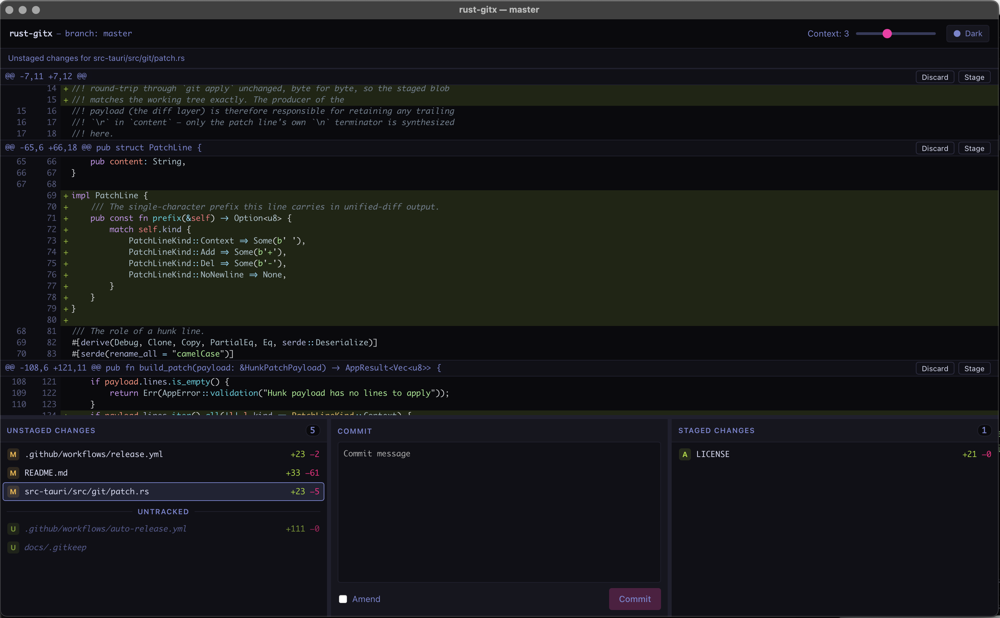

<div align="center">


# gitrx

Hunk-level git staging for macOS.

[](https://github.com/ninetwentyfour/gitrx/actions/workflows/ci.yml)
[](../../releases)
[](LICENSE)
-lightgrey>)

Built with Tauri 2 · Rust · React · bun

</div>



This is the GitX staging screen — the one screen worth keeping — rebuilt as a fast, stable Tauri app: a Rust + git2 engine behind a React front. It shows a working tree's status and lets you stage, unstage, discard, and commit at the file or hunk level, with a context slider on each diff and a live view backed by a filesystem watcher.

## Install

Download the latest `.app` from [Releases](../../releases). Builds are unsigned, so on first launch right-click the app and choose **Open** to get past Gatekeeper.

The `gitrx` command-line launcher opens a repository from your terminal. Install it from the running app via **gitrx ▸ Install Command Line Tool…**, or from a checkout:

```sh
./scripts/install-cli.sh
```

Then `gitrx .` opens the current directory's repository — or any subdirectory of one; the app walks up to the enclosing working tree. It runs as a single instance with one window per repository: invoking `gitrx <path>` for an already-open repo focuses that window instead of spawning another.

## Building from source

Prerequisites: a stable Rust toolchain and [bun](https://bun.sh/).

```sh
bun install
bunx tauri build --bundles app
```

The verification gate is zero-warnings on both languages. Rust: `cargo build`, `cargo clippy --all-targets -- -D warnings`, `cargo test`, `cargo fmt --check` (from `src-tauri/`). Frontend: `bun run typecheck`, `lint`, `test`, `build`, `fmt:check`.

## CI & releases

Every push to `master` and every pull request runs the full gate — Rust build/clippy/test/fmt on macOS, frontend typecheck/lint/test/build/fmt on Ubuntu.

Releases are automatic on a green `master`: once CI passes, the patch version in `src-tauri/tauri.conf.json` is bumped, committed, tagged `vX.Y.Z`, then built and published to a GitHub release in the same run. That `version` field is the single source of truth for release and bundle naming.

For a deliberate minor or major bump, tag manually — `git tag vX.Y.Z && git push --tags` — which builds and uploads to a **draft** release for review. Bump `tauri.conf.json`'s `version` to match in the same commit you tag. A Windows build runs alongside the macOS bundle as an experimental canary; it reports what breaks without failing the release.

## Acknowledgments

Descended from [GitX](https://github.com/pieter/gitx) by Pieter de Bie — this is its staging screen, carried forward.

## License

[MIT](LICENSE).
